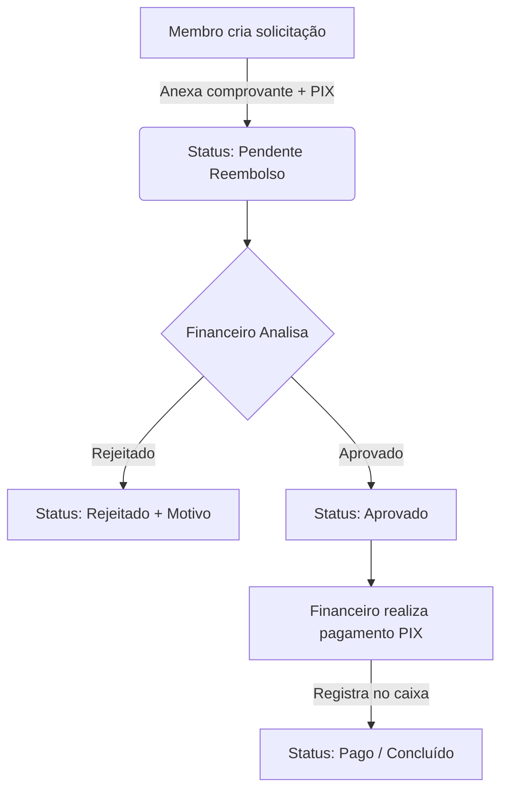
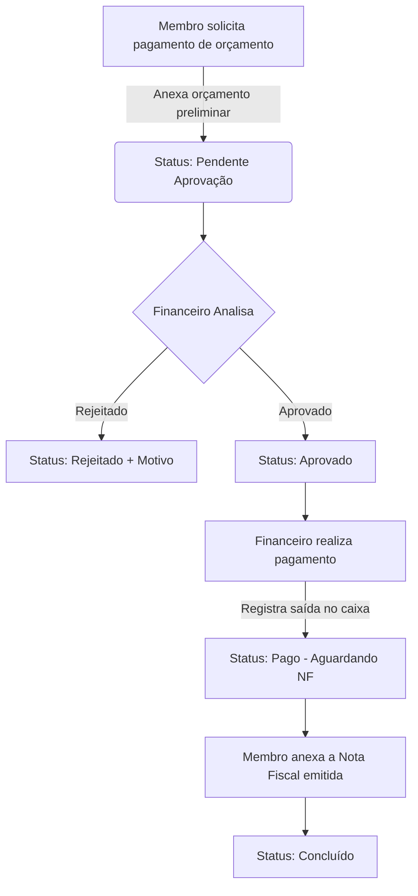

# 💰 Finanças SGM — Sistema de Gestão Financeira

> Sistema de gestão financeira desenvolvido para o movimento **Segue-me**, com o objetivo de simplificar o controle de fluxo de caixa, pagamentos de orçamentos e solicitações de reembolsos das equipes de trabalho.

---

## 📌 Sumário
- [Recursos Principais](#-recursos-principais)
- [Como Funciona](#-como-funciona)
- [Stack Tecnológica](#-stack-tecnológica)
- [Arquitetura do Projeto](#-arquitetura-do-projeto)
- [Configuração do Ambiente](#%EF%B8%8F-configura%C3%A7%C3%A3o-do-ambiente)
- [Scripts Disponíveis](#-scripts-dispon%C3%ADveis)
- [Segurança e Perfis](#-seguran%C3%A7a-e-perfis)

---

## 🚀 Recursos Principais

### 1. Painel das Equipes (Membros)
*   **Cadastro Simplificado**: Cadastro de usuários vinculado à sua respectiva equipe (ex: *Comando, Fichas, Pós-encontro, Montagem, Palestra*).
*   **Solicitação de Reembolso**: Envio de solicitações de reembolso com descrição, finalidade, valor, chave PIX e anexo do comprovante.
*   **Solicitação de Pagamento de Orçamento**: Cadastro de solicitações de pagamentos diretos para fornecedores, com data de vencimento e anexo do orçamento inicial.
*   **Envio de Notas Fiscais**: Fluxo para anexar a Nota Fiscal (NF) definitiva às solicitações de orçamento aprovadas.
*   **Acompanhamento em Tempo Real**: Histórico de solicitações com status atualizado (Pendente, Aprovado, Pago, Rejeitado, etc.).

### 2. Painel de Finanças (Administrador)
*   **Aprovação de Usuários**: Moderação de novos cadastros de equipe para garantir a segurança do sistema.
*   **Fluxo de Caixa Mensal**: Gestão dinâmica de entradas (`IN`) e saídas (`OUT`), categorizadas por área e com notas internas.
*   **Fechamento de Mês**: Controle de saldo inicial e final de cada período, com congelamento dos meses encerrados.
*   **Análise de Solicitações**: Interface robusta para aprovar, rejeitar (especificando o motivo) ou marcar como pago os reembolsos e orçamentos solicitados.
*   **Relatórios e Gráficos**: Gráficos interativos (usando *Recharts*) exibindo a saúde financeira e exportação de dados para relatórios.
*   **Armazenamento de Anexos**: Upload seguro e visualização de comprovantes diretamente pelo sistema.

---

## 🔄 Como Funciona

### Fluxo de Reembolso


### Fluxo de Pagamento de Orçamento


---

## 🛠️ Stack Tecnológica

O sistema foi construído utilizando tecnologias modernas e eficientes no ecossistema do React/Next.js:

*   **Framework**: [Next.js 16 (App Router)](https://nextjs.org/) com [React 19](https://react.dev/)
*   **Banco de Dados & ORM**: [Prisma ORM](https://www.prisma.io/) com [PostgreSQL](https://www.postgresql.org/) (Neon DB com pooling de conexões)
*   **Estilização**: [Tailwind CSS v4](https://tailwindcss.com/)
*   **Armazenamento de Arquivos**: [@vercel/blob](https://vercel.com/docs/storage/vercel-blob) para upload de Notas Fiscais e comprovantes
*   **Segurança & Autenticação**: [Jose (JWT)](https://github.com/panva/jose) para gerenciamento de sessões seguras em cookies `httpOnly`
*   **Validação de Dados**: [Zod](https://zod.dev/) para esquemas de validação de formulários e APIs
*   **Gráficos**: [Recharts](https://recharts.org/) para visualizações analíticas no dashboard

---

## 📂 Estrutura de Diretórios

```text
finanças-sgm/
├── prisma/               # Schema do banco de dados (Prisma) e scripts de seed
├── public/               # Ativos públicos (imagens, ícones)
├── src/
│   ├── app/              # Estrutura do App Router do Next.js (páginas e rotas de API)
│   │   ├── actions/      # Server Actions (auth, finance, reembolsos, pagamentos, etc.)
│   │   ├── financas/     # Rotas do painel financeiro/admin
│   │   ├── pagamentos/   # Rotas de solicitações das equipes
│   │   └── ...
│   ├── components/       # Componentes React reutilizáveis (tabelas, filtros, formulários)
│   ├── lib/              # Configurações de clientes (prisma, auth, validações Zod)
│   └── types/            # Definições de tipos TypeScript
```

---

## ⚙️ Configuração do Ambiente

### Pré-requisitos
*   [Node.js](https://nodejs.org/) (v18 ou superior recomendado)
*   Gerenciador de pacotes `npm` ou `yarn`

### 1. Clonar o repositório
```bash
git clone https://github.com/gabriielk0/financas-sgm.git
cd financas-sgm
```

### 2. Configurar as variáveis de ambiente
Crie um arquivo `.env` na raiz do projeto (use o `.env.example` como referência):
```bash
cp .env.example .env
```

Preencha as variáveis no seu `.env`:
*   `DATABASE_URL`: URL de conexão do PostgreSQL (com suporte a pooling, como o Neon DB).
*   `DATABASE_URL_UNPOOLED`: URL de conexão direta ao banco de dados (sem pooling, usada pelo Prisma para executar migrations).
*   `BLOB_READ_WRITE_TOKEN`: Token de leitura/escrita do Vercel Blob para upload de arquivos.
*   `APP_PASSWORD`: Senha mestre para o acesso padrão do módulo de finanças (padrão: `segueme`).

### 3. Instalar as dependências
```bash
npm install
```

### 4. Preparar o Banco de Dados
Gere as tabelas e popule o banco de dados com dados de demonstração:
```bash
# Executa o push do esquema do Prisma para o banco
npm run db:push

# Executa o seed para gerar transações e saldos fictícios nos meses anteriores
npm run db:seed
```

### 5. Iniciar o servidor de desenvolvimento
```bash
npm run dev
```
O sistema estará disponível em [http://localhost:3000](http://localhost:3000).

---

## 📦 Scripts Disponíveis

*   `npm run dev`: Inicia o servidor de desenvolvimento do Next.js.
*   `npm run build`: Executa a geração do client do Prisma, roda as migrations e compila a aplicação para produção.
*   `npm run start`: Inicia o servidor compilado em modo de produção.
*   `npm run lint`: Executa a verificação de regras de linting (ESLint).
*   `npm run db:push`: Atualiza o banco de dados de acordo com o `schema.prisma`.
*   `npm run db:studio`: Abre o Prisma Studio (interface visual para gerenciar o banco de dados).
*   `npm run db:seed`: Roda o script de seed para popular o banco de dados.

---

## 🔐 Segurança e Perfis

O sistema possui dois perfis principais de acesso:

1.  **Financeiro / Admin**:
    *   **Acesso Padrão**: E-mail `financas@segueme.local` (ou qualquer e-mail cadastrado com perfil `financas` e aprovado).
    *   **Senha de Fallback**: Caso não existam usuários no banco de dados, é possível entrar informando apenas a senha definida em `APP_PASSWORD` no arquivo `.env`.
    *   Acesso total a relatórios, fechamentos, lançamentos manuais de caixa e moderação de usuários/solicitações.
2.  **Equipe (Usuários Comuns)**:
    *   Necessita de cadastro informando Nome, E-mail, WhatsApp, Senha e Equipe de trabalho.
    *   O login só é liberado após um administrador do painel financeiro alterar o status do usuário para **Ativo**.
    *   Acesso restrito para criar e monitorar suas próprias solicitações de pagamentos e reembolsos.

